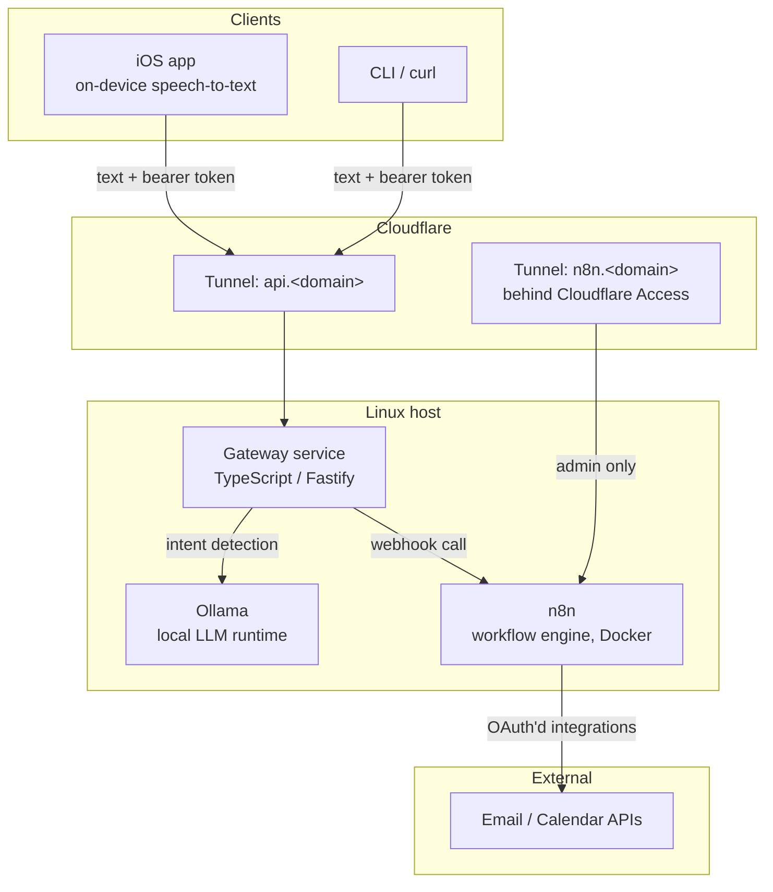

# Architecture

## Overview

Xavi Assistant is a local-first personal assistant. All heavy components run on a single Linux machine ("the host"). Clients reach it exclusively through Cloudflare Tunnels — no ports are opened on the home network.

## Components

### Gateway service (`apps/gateway`)

The single entry point for commands. A small Fastify (TypeScript) API that:

1. Authenticates the request (static bearer token to start; revisit if more clients appear).
2. Sends the command text to Ollama to classify the **intent** and extract parameters.
3. Dispatches to the matching **skill** — usually an n8n webhook — and returns the result as text, ready to be displayed or spoken by the client.

The gateway owns the *skill registry*: a typed catalog mapping intents to n8n webhook URLs. Skills live in n8n; the gateway only routes.

### Ollama (host-native)

Runs directly on the host (not in Docker) for straightforward GPU access. The gateway talks to it on `localhost:11434`. Model choice is a per-skill concern; intent detection favors a small, fast instruct model.

### n8n (Docker)

The automation engine. Each assistant skill (check email, today's agenda, …) is an n8n workflow triggered by webhook. n8n holds the OAuth credentials for external services (Google, etc.) in its encrypted store — those credentials never appear in this repo.

Runs via `infra/docker-compose.yml` with a persistent volume. Workflow definitions are exported to `infra/n8n/workflows/` **sanitized** (credentials stripped) so they can be versioned and shared.

### Cloudflare Tunnels

Two public hostnames, one `cloudflared` daemon on the host:

| Hostname | Target | Protection |
|---|---|---|
| `api.<domain>` | Gateway | Bearer token enforced by the gateway itself |
| `n8n.<domain>` | n8n editor UI | **Cloudflare Access** (email OTP) — the editor must never be reachable unauthenticated |

### iOS app (`apps/ios`, Phase 3)

Native Swift. Uses `SFSpeechRecognizer` with `requiresOnDeviceRecognition = true` so audio is transcribed locally and only text is sent to the gateway. Native also opens the door to Siri / App Intents integration ("Hey Siri, ask Xavi…"). Developed on macOS/Xcode but versioned inside this monorepo.

## Security model

Threat model: the gateway and the n8n editor are exposed to the public internet through the tunnels, and the repo itself is public.

- **Transport:** everything through Cloudflare Tunnel (TLS, no open inbound ports).
- **Gateway auth:** bearer token from day one; rate limiting at Cloudflare.
- **n8n editor:** Cloudflare Access in front; n8n basic auth as a second layer.
- **Secrets:** only in `.env` files (gitignored) and n8n's encrypted credential store. `.env.example` documents every variable. `gitleaks` runs in CI and as a pre-commit hook.
- **Dependencies:** minimal and pinned; Renovate for updates; `pnpm audit` in CI.

## Monorepo tooling

- **pnpm workspaces + Turborepo** for the TypeScript packages (`apps/gateway`, `packages/shared`).
- `apps/ios` is a plain Xcode project — versioned here, built with Xcode, not managed by pnpm/Turbo.
- Shared lint/format config at the root (ESLint + Prettier), CI via GitHub Actions.
